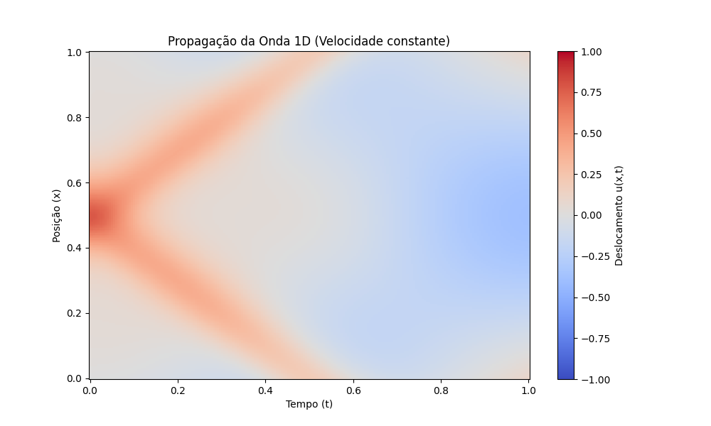

# CN2_PINNs

Este projeto é uma implementação de **Redes Neurais Informadas pela Física (PINNs)** para simular a **Equação da Onda 1D e 2D**. O objetivo é explorar como as PINNs podem ser usadas para modelar a propagação de ondas em cenários com velocidades constantes e variáveis.

## Sumário Visual

Abaixo estão alguns exemplos dos resultados gerados pelos modelos treinados.

**Simulação 1D (Velocidade Constante):**


**Simulação 2D (Velocidade Variável):**


## Instalação

Siga os passos abaixo para configurar o ambiente de desenvolvimento.

1.  **Clone o repositório:**
    ```bash
    git clone [https://github.com/rubmloures/CN2_PINNs.git](https://github.com/SEU-USUARIO/CN2_PINNs.git)
    cd CN2_PINNs
    ```

2.  **Crie e ative um ambiente virtual** (altamente recomendado):
    ```bash
    # Criar o ambiente
    python -m venv venv
    
    # Ativar no Linux/macOS
    source venv/bin/activate
    
    # Ativar no Windows
    .\venv\Scripts\activate
    ```

3.  **Instale as dependências:**
    ```bash
    pip install -r requirements.txt
    ```

## Como Usar

Você pode treinar os modelos e executar as simulações usando os scripts principais. Os parâmetros de cada simulação são controlados pelos arquivos na pasta `config/`.

### Simulação 1D

Use `main.py` para simulações 1D:

```bash
# Para velocidade constante
python main.py --config config/config_constante.py

# Para velocidade variável
python main.py --config config/config_variavel.py
```
### Simulação 2D

Use main_2d.py para simulações 2D:
```bash
# Para velocidade variável (2D)
python main_2d.py --config config/config_2d_variavel.py
```

## Resultados e Análise

Os resultados de cada execução são salvos automaticamente na pasta resultados/, organizados pelo nome da configuração utilizada (ex: resultados/constante/).

Isso inclui:

  - Plots (.png): Gráficos da propagação da onda, snapshots e histórico de perdas.

 - Histórico (.csv): Arquivos CSV com o histórico de treinamento.

 - Modelo (.pth): O modelo PyTorch treinado.

Para uma análise mais detalhada da performance do modelo, você pode utilizar o Jupyter Notebook fornecido:

```bash
jupyter notebook notebooks/avaliacao_modelo.ipynb
```

## Estrutura do Projeto

├── config/         # Arquivos de configuração para diferentes simulações
├── notebooks/      # Jupyter Notebooks para análise, como avaliacao_modelo.ipynb
├── resultados/     # Plots, CSVs e modelos (.pth) salvos
├── src/            # Código fonte principal (modelo, física, trainer, etc.)
├── main.py         # Script principal para simulações 1D
├── main_2d.py      # Script principal para simulações 2D
└── requirements.txt  # Dependências do projeto

## 📄 Licença

Este projeto ainda não possui uma licença. Considere adicionar um arquivo LICENSE (ex: MIT, Apache 2.0) para definir como outros podem utilizá-lo.
